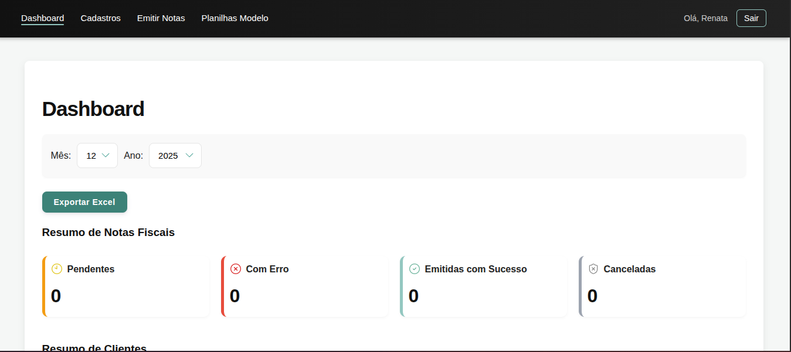
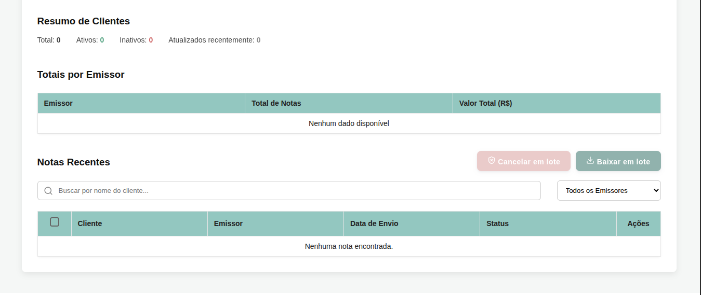
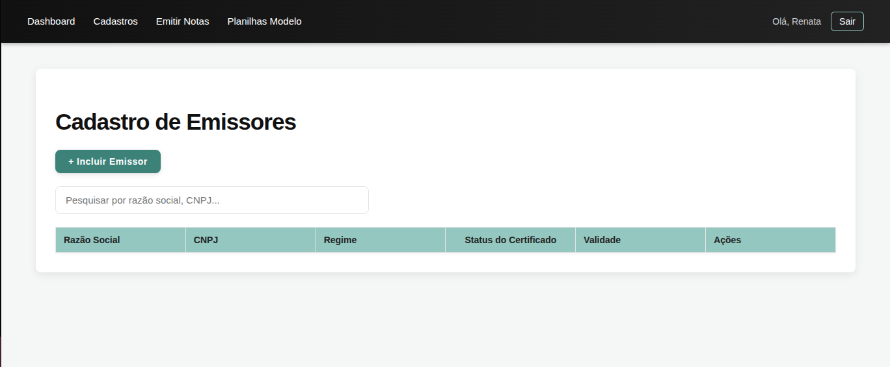
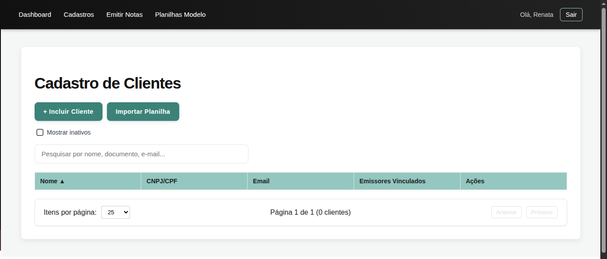
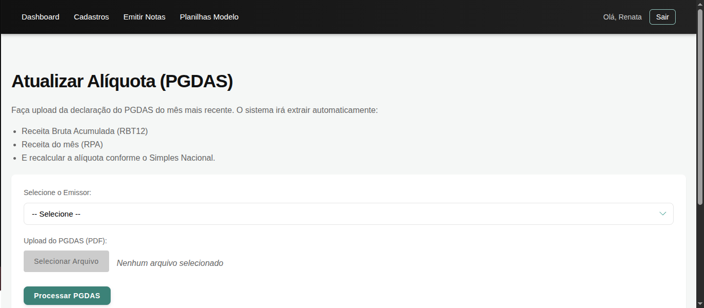
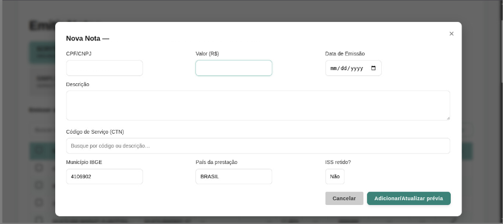
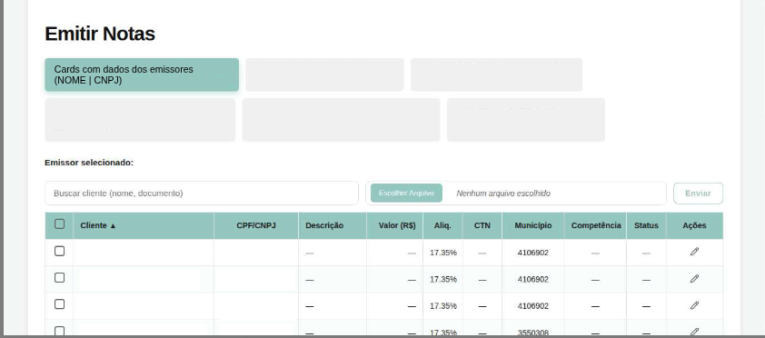

# 🧾 Emissor de NFSe

Sistema para **emissão de Nota Fiscal de Serviços Eletrônica (NFSe)**, desenvolvido com **backend em Python** e **frontend web**, aderente ao **novo modelo de emissão do Portal Nacional de NFSe**, com foco em automação fiscal, segurança e operação multi-emissor.

---

## 📌 Sobre o Projeto

Este projeto foi desenvolvido para atender às recentes mudanças do **Portal Nacional de NFSe**, oferecendo uma solução centralizada para **emissão, cancelamento e gerenciamento de notas fiscais de serviços**.

O sistema permite a **gestão de múltiplos emissores**, cada um com suas próprias configurações fiscais, certificados digitais e dados de cálculo, além de manter uma **base de dados de clientes editável**, integrada à **API gratuita da Receita Federal** para consulta e atualização cadastral.

Atualmente, o sistema é **funcional e utilizado em ambiente interno**, executando em **rede local**, com acesso restrito aos usuários do escritório.

> ⚠️ Este projeto não é open source e não possui homologação oficial para uso público irrestrito.

---

## 🚀 Funcionalidades

### 🏢 Gestão de Emissores

* Cadastro de múltiplos emissores
* Configurações fiscais independentes por emissor
* Associação de certificado digital individual
* Validação de status e validade do certificado
* Input inicial de dados do **PGDAS-D** por emissor

---

### 👥 Gestão de Clientes

* Cadastro manual de clientes
* Importação via planilhas modelo
* Consulta e atualização cadastral via **API da Receita Federal**
* Base de dados editável e reutilizável
* Vínculo de clientes a múltiplos emissores

---

### 🧮 Cálculo Fiscal Automatizado

* Cálculo automático da **alíquota efetiva mensal**
* Baseado nos dados do **PGDAS-D**
* Atualização mensal por emissor
* Redução de cálculos manuais e erros operacionais

> ⚠️ É necessário fornecer o PDF do PGDAS para o primeiro cálculo de cada emissor.

---

### 🧾 Emissão e Cancelamento de NFSe

* Emissão de NFSe diretamente pelo **Portal Nacional**
* Cancelamento de notas pelo próprio sistema
* Comunicação com webservice oficial
* Tratamento e validação dos retornos

---

### 📥 Download de Documentos

* Download do **XML da NFSe**
* Geração e download do **PDF (DANFSe)**
* Download **individual ou em lote**
* Organização por emissor e período

---

### 📊 Dashboard Operacional

* Filtros por mês e ano
* Resumo de status das notas fiscais
* Totalização por emissor
* Exportação de dados em Excel
* Ações em lote (cancelamento e download)

---

## 🧠 Arquitetura e Fluxo Lógico

```text
┌──────────────────┐
│  Interface Web   │
│ (Frontend - UI)  │
└────────┬─────────┘
         │
         ▼
┌──────────────────┐
│  Backend (API)   │
│  Python          │
└────────┬─────────┘
         │
         ├──► Gestão de Emissores
         │       ├─ Certificados Digitais
         │       ├─ Configurações Fiscais
         │       └─ Dados do PGDAS
         │
         ├──► Gestão de Clientes
         │       ├─ Cadastro Manual
         │       └─ API Receita Federal
         │
         ├──► Cálculo Fiscal
         │       ├─ Receita Bruta (RBT12)
         │       ├─ Alíquota Efetiva
         │       └─ Simples Nacional
         │
         ├──► NFSe
         │       ├─ Emissão
         │       ├─ Cancelamento
         │       ├─ XML
         │       └─ PDF
         │
         ▼
┌────────────────────────┐
│ Portal Nacional de NFSe│
│  (Webservice Oficial)  │
└────────────────────────┘
```

---

## 🖥️ Interface

### Dashboard
Visão geral das notas fiscais, com filtros por período, status de emissão, cancelamento das notas, exportação de dados e ações em lote.




### Cadastro de Emissores
Cadastro e gerenciamento de múltiplos emissores, com configuração fiscal, certificado digital e controle de validade.



### Cadastro de Clientes
Cadastro, busca, importação via planilha e atualização automática de dados cadastrais.


### Atualização de Alíquota (PGDAS)
Upload do PGDAS para cálculo automático da alíquota efetiva mensal conforme o Simples Nacional.



### Emissão e Gestão de Notas
Tela para geração de rascunhos de NFSe, permitindo a criação individual ou em lote via importação de planilha. Após a validação dos dados, o usuário seleciona os rascunhos desejados e aciona a opção **Emitir Nota** para envio ao Portal Nacional.



---

## 🔐 Segurança

* Certificados digitais armazenados fora do repositório
* Pasta `uploads/` ignorada pelo Git
* Variáveis sensíveis isoladas em `.env`
* Acesso restrito a usuários autenticados
* Execução em rede local controlada

---

## ⚠️ Aviso Legal

* Este projeto não possui homologação oficial
* Não substitui sistemas fiscais certificados
* As regras fiscais variam conforme o município
* Uso recomendado apenas para fins internos, educacionais ou demonstrativos

---

## 📄 Licença

**© Todos os direitos reservados.**

Este software é de **propriedade exclusiva do autor**.
A visualização do código é permitida apenas para fins educacionais e de avaliação técnica.

❌ É proibido:

* Uso comercial
* Redistribuição
* Modificação
* Publicação parcial ou total sem autorização expressa

---

## ✔️ Status do Projeto

* Funcional e estável
* Utilizado em ambiente interno
* Execução em rede local
* Nenhuma informação sensível versionada
* Alinhado ao Portal Nacional de NFSe

---
